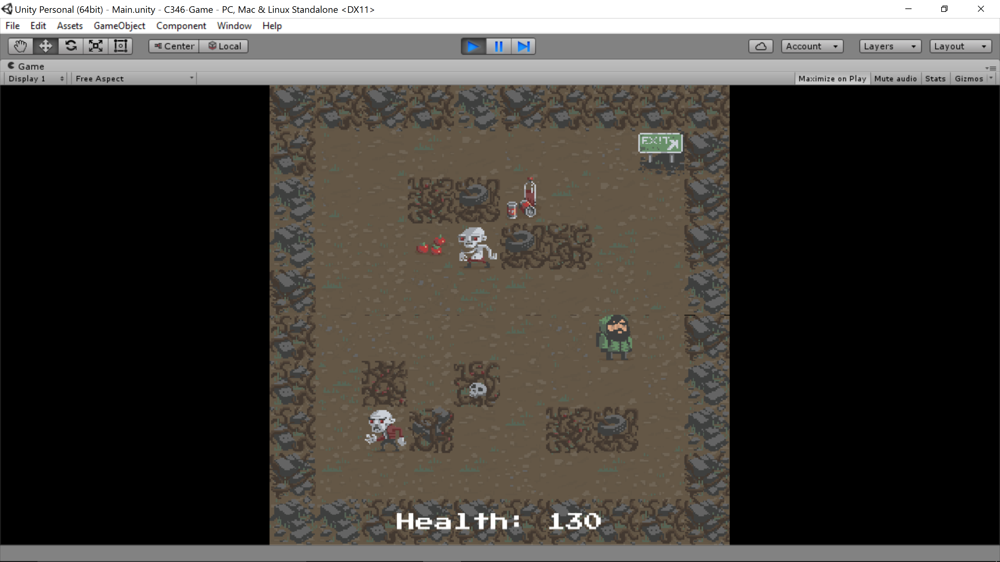

##HW8 Project Update##

Our game is coming along fairly well. We haven't had as much time to work on it lately, but we have the basic framework and much of the basic game logic done. 

In the above screenshot you can see our player existing in the world. In the final game our overworld levels will be much larger but we scaled the size back for demo purposes. Our procedural level generation can also be viewed in the screenshots. 

The above screen shows enemies spawned in with our player, as well as some health items on the ground. We also have a basic combat system in the game which allows enemies to be attacked and killed. 

Our plans for the rest of the semester include trying to get a better item system put into the game, implementing a leveling system, and creating more enemies for a more robust combat system. I'm also currently working on a cave generator so we can have more than just the overland levels. 

